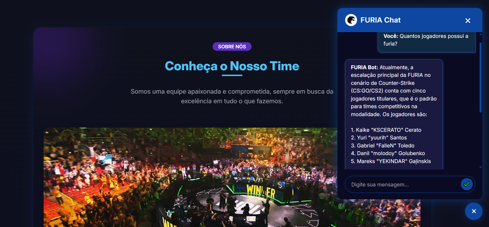

# 🎯 Universo Furia

**O projeto é uma landing page composta por diversas seções que apresentam um resumo e informações sobre o time, incluindo a formação atual, campeonatos disputados e gameplays. 
Além disso, conta com um chatbot interativo, capaz de fornecer informações específicas como: quem foi o criador da FURIA, datas dos próximos jogos, curiosidades, entre outros detalhes relevantes.**

---

## 📸 Screenshot



---

## 🚀 Funcionalidades

- ✅ Chatbot com IA para interações com fãs
- ✅ Página sobre os jogadores e estatísticas
- ✅ Integração com redes sociais
- ✅ Layout responsivo e animações AOS

---

## 🛠️ Tecnologias Utilizadas

- [Python](https://www.python.org/)
- [Flask](https://flask.palletsprojects.com/)
- [Tailwind CSS](https://tailwindcss.com/)
- [AOS - Animate on Scroll](https://michalsnik.github.io/aos/)
- [JavaScript](https://developer.mozilla.org/en-US/docs/Web/JavaScript)

---

## 🚀 Adicionando a chave da OpenAI no arquivo .env

### 1. Pegar a chave da OpenAI:
- **Passo 1:** Acesse o site da [OpenAI](https://platform.openai.com/).

- **Passo 2:** Faça login ou crie uma conta.

- **Passo 3:** Após o login, vá até a seção **API Keys**.

- **Passo 4:** Clique em **"Create new secret key"** (Criar nova chave secreta).

- **Passo 5:** Copie a chave gerada e guarde-a em um lugar seguro. Ela será algo como `sk-xxxxxxxxxxxxxxxxxxxxxxxxxx`.

### 2. Criar o arquivo .env:
- **Passo 1:** Na raiz do seu projeto (mesmo nível do `app.py`), crie um arquivo chamado `.env`.

- **Passo 2:** Dentro do arquivo `.env`, adicione a chave da OpenAI da seguinte forma:

```env
OPENAI_API_KEY=sk-xxxxxxxxxxxxxxxxxxxxxxxxxx
```

### 3. Adicionar o arquivo .env ao .gitignore
Para garantir que a chave não seja compartilhada publicamente no GitHub, adicione o arquivo `.env` ao `.gitignore`:

- **Passo 1:** Abra (ou crie) o arquivo `.gitignore` na raiz do seu projeto.

- **Passo 2:** Adicione as linha a seguir:

```bash
.env
__pycache__/
*.pyc
```

### 4. Instalar o pacote python-dotenv
Certifique-se de que o pacote `python-dotenv` esteja instalado, para carregar as variáveis de ambiente do `.env`:

Instale o `python-dotenv` com o comando:

```bash
pip install python-dotenv
```

---

## ⚙️ Instalação

Siga os passos abaixo para configurar o projeto localmente:

- **Passo 1** - Clone o repositório::
~~~
    https://github.com/isem49/Furia-ChatBot
~~~

- **Passo 2** - Crie e ative o ambiente virtual::
 
_Linux_
~~~
    .venv/bin/activate
~~~
_Windows_
~~~
    .\venv\Scripts\activate
~~~

- **Passo 3** - Instale todas as dependências:
~~~
    pip install -r requirements.txt
~~~

- **Passo 4** - Execute um servidor interno e divirta-se! ;)
~~~
    flask run
~~~


